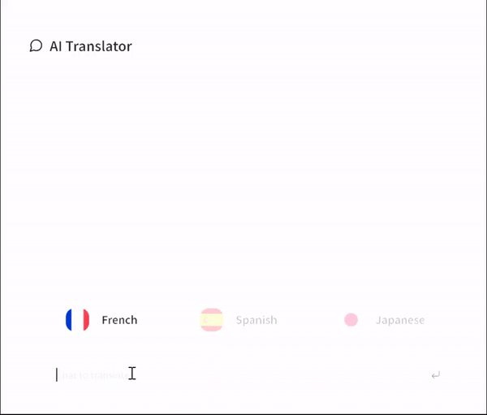

# AI Translator

A Next.js application that provides real-time language translation using gpt-4o-mini.

### Description

AI Translator is a web application that allows users to input text and receive translations in various languages. It features a chat-like interface for a seamless user experience.



### Features

- Real-time text translation
- Language selection
- Chat-like interface for input and output
- Responsive design

#### Technical Features

- Built with Next.js for server-side rendering
- Uses React for building the user interface
- Written in TypeScript for type safety
- Styled with Tailwind CSS for rapid development
- Chat input disabled while waiting for translation

## Development

### Project Structure

```
ai-translator/src/
├── app/
│   ├── api/
│   │   └── translate/
│   │       └── route.ts         # New API route for translation
│   ├── globals.css              # Global styles
│   ├── layout.tsx               # Main layout component
│   └── page.tsx                 # Main page component
├── components/
│   ├── AiChat.tsx               # Main chat component managing state and logic
│   ├── ChatInput.tsx            # Input component for user messages
│   ├── Header.tsx               # Header component
│   ├── LanguageSelector.tsx     # Component for selecting target language
│   └── Translation.tsx          # Components for displaying input and output messages
├── subframe/                    # Subframe UI components
├── hooks/                       # Custom hooks
│   ├── useTranslation.ts        # Translation hook
│   ├── useChat.ts               # Chat hook    
│   └── useLanguage.ts           # Language hook
├── services/
│   └── translationService.ts    # Translation service
├── lib/
│   └── openai.ts                # OpenAI client configuration
└── other files ...
```

### Technologies

- Next.js 14+ (App Router)
- React 18+
- OpenAI JS SDK
- TypeScript
- Tailwind CSS
- pnpm (Package Manager)

## Getting Started

1. Clone the repository:
   ```
   git clone 
   cd ai-translator
   ```

2. Install dependencies:
   ```
   pnpm install
   ```

3. Add environment variables:
   Create a `.env` file in the root directory and add the following variables:
   ```
   OPENAI_API_KEY=your_api_url_here
   ```
   Replace `your_api_url_here` with the actual URL of your translation API.

3. Run the development server:
   ```
   pnpm dev
   ```

4. Open [http://localhost:3000](http://localhost:3000) with your browser to see the result.

## Environment Variables

Create a `.env.local` file in the root directory and add the following variables:

```
NEXT_PUBLIC_API_URL=your_api_url_here
```

Replace `your_api_url_here` with the actual URL of your translation API.

## Contributing

Contributions are welcome! Please feel free to submit an issue to report a bug or request a feature. 
If you would like to contribute code, please fork the repository and submit a pull request.

### Roadmap

v 0.1.0
- [x] Basic components and layout
- [x] Chat input and output
- [x] Language selection
- [x] Use OpenAI GPT-4 for translation
- [x] Add translation service
- [x] Use custom hooks

v 0.2.0
- [ ] Implement better state management with Context API
- [ ] Performance optimization with Memoization
- [ ] Implement virutal scrolling for efficient rendering

v 0.3.0
- [ ] Implement streaming translation
- [ ] Implement code splitting for better performance
- [ ] Add progressive loading with Skeleton UI
- [ ] Add streaming translation
- [ ] SSR optimization with getServerSideProps

v 0.4.0
- [ ] Better error handling
- [ ] Add unit tests with Jest and React Testing Library
- [ ] Add end-to-end tests with Cypress
mkdir
v 0.5.0
- [ ] Add voice input and output support
- [ ] Add real-time translation with WebSockets


## License

This project is licensed under the MIT License.
