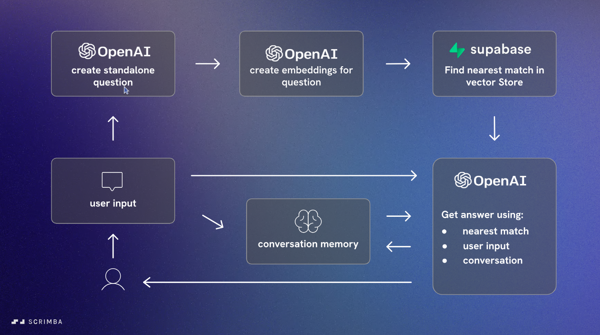

# Langchain Chat Bot

A simple chat bot used to chat with document built using Langchain, OpenAI and Supabase.



### Features

- Chat with the bot about scrimba courses
- Conversation history is saved locally
- Uses OpenAI to generate responses, embeddings and retrieve documents
- Uses Supabase as vector storage

## Getting Started

### Technologies

- Node.js
- pnpm
- Supabase
- OpenAI
- Langchain

### Installation

1. Clone the repository and go to the project directory

```bash
git clone <repo-url>
cd langchain-chat
```

2. Install dependencies

```bash
pnpm install
```

3. Create a `.env` file in the root directory and add the following environment variables

```bash
SUPABASE_API_KEY=your-supabase-api-key
SUPABASE_URL=your-supabase-url
OPENAI_API_KEY=your-openai-api-key
```

### Vector Store Setup

1. Have access to OpenAI API
2. Have access to Supabase and create a new project and add query from `src/db/match_documents.sql` to create the `documents` table
3. Load document, generate embeddings and save embeddings to Supabase vector storage by running:

```bash
pnpm load
```

### Development

1. Open live server from index.html

## Roadmap

**v 0.1.0**

- [x] Create a chatbot that can chat about scrimba courses
- [x] Save conversation history locally
- [x] Use OpenAI to generate responses
- [x] Use OpenAI to generate embeddings
- [x] Use OpenAI to retrieve documents
- [x] Use Supabase as vector storage

**v 0.2.0**

- [ ] Make file input for users to upload their own documents
- [ ] Update prompts to be suited to any document upload
- [ ] Update the chatbot to be able to chat about any document uploaded
- [ ] Update UI

## Credits

- This project was developed with the help of materials from [The Official Langchain Course](https://v2.scrimba.com/the-official-langchainjs-course-c02t) from [Scrimba](https://v2.scrimba.com/).
