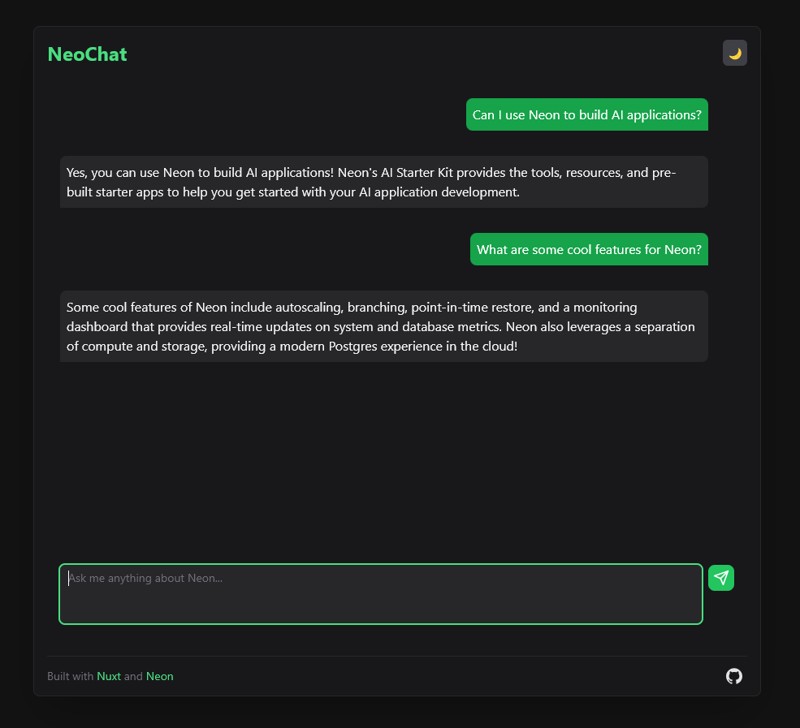

# RAG Chatbot Starter
   


This project serves as a starter template for creating Retrieval-Augmented Generation (RAG) chatbots using `NeonDB` and `OpenAI's GPT` models. Built with `Nuxt 3` and `Tailwind CSS`, it provides a solid foundation for developing intelligent, context-aware chatbot applications with a modern web interface.

Live Demo: [RAG Chatbot Starter](https://ai-apps-mu.vercel.app/)


## Features

- **RAG Architecture**: Implements a Retrieval-Augmented Generation system for more accurate and context-aware responses.
- **Converstation History**: Stores chat history for enhanced context and continuity.
- **Neon Postgres Integration**: Uses Neon Postgres as a vector database for efficient storage and retrieval of embeddings.
- **OpenAI Integration**: Leverages OpenAI's powerful language models for generating responses.
- **Nuxt 3 Framework**: Built on Nuxt 3, offering a modern, performant foundation for web applications.
- **Tailwind CSS**: Utilizes Tailwind CSS for rapid UI development and easy customization.
- **Modular Design**: Structured for easy understanding and extension of core functionalities.
- **Serverless-Ready**: Prepared for deployment on serverless platforms like Cloudflare Workers.

## Architecture Overview

1. **Frontend**: Nuxt 3 application with Tailwind CSS for styling.
2. **Backend**: Nuxt server routes for handling API requests.
3. **Vector Database**: Neon Postgres with pgvector for storing and querying document embeddings.
4. **Language Model**: OpenAI's GPT model for generating responses.
5. **RAG Pipeline**:
   - Query embedding
   - Vector similarity search
   - Context retrieval
   - Response generation

## Getting Started

### Prerequisites

- Node.js (v18+)
- pnpm
- Neon account with a pgvector-enabled database
- OpenAI account with API access
- (Optional) Vercel, Netlify, or Cloudflare Workers account for deployment

### Setup for Local Development

1. Clone the repository:
   ```bash
   https://github.com/sreeharsha-rav/ai-apps/tree/main/nuxt-rag-chat
   cd nuxt-rag-chat
   ```

2. Install dependencies:
   ```bash
   pnpm install
   ```

3. Set up environment variables:
   Create a `.env` file in the project root:
   ```
   OPENAI_API_KEY=your_openai_api_key
   NEON_CONNECTION_STRING=your_neon_connection_string
   ```

4. Prepare your vector database:
   - Use the [RAG Document Loader](https://github.com/sreeharsha-rav/ai-apps/tree/main/rag-doc-loader) to generate and store vector embeddings in your Neon database.

5. Start the development server:
   ```bash
   pnpm run dev
   ```

   Access the application at `http://localhost:3000`

## Customization Guide

1. **Modify the UI**: Edit Vue components in the `components/` directory.

2. **Adjust RAG Logic**: Modify the retrieval and generation process in `server/utils/aiSingleton.ts`.

3. **Prompt Engineering**: Update the prompts and responses in `server/utils/prompts.ts`.

3. **Change Language Model**: Update the OpenAI model or switch to a different provider in `server/utils/aiSingleton.ts`.

4. **Extend Vector Store**: Modify or replace the Neon Postgres integration in `server/utils/aiSingleton.ts`.

5. **Add New Features**: Implement additional server routes in `server/api/` and corresponding client-side logic.

## Deployment

### Build for Production

```bash
pnpm run build
```

- For serverless deployment follow the instructions for your chosen platform:
   - [Nuxt Guide](https://nuxt.com/docs/getting-started/deployment)
   - [Vercel](https://vercel.com/docs)
   - [Netlify](https://docs.netlify.com/)
   - [Cloudflare Workers](https://developers.cloudflare.com/workers/)

## Contributing

Contributions are welcome! Please feel free to submit a Pull Request.

- **Possible Improvements**:
  - UI enhancements - Move suggestions to bottom, make it random, etc.
  - Better error handling and edge case client-server interactions
  - Add authentication
  - Enhance the RAG pipeline with better retrieval strategies
  - Better handling of conversation history and context with user sessions
  - Option to upload and store custom documents for retrieval

## License

This project is open source and available under the [MIT License](LICENSE).